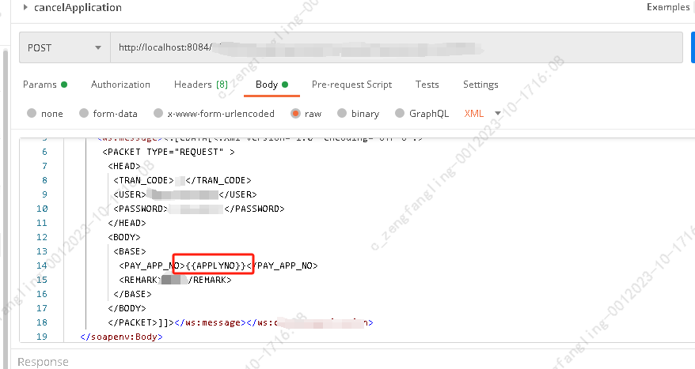
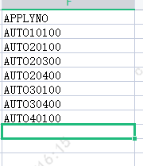

- [postman请求时params中传输json格式的String参数](https://blog.csdn.net/weixin_51191538/article/details/127332119)
#### postman请求时params中传输json格式的String参数
- 在postman中json主要用到的符号[]{}可以用相关编码进行转义，如：    
  [->%5B    
  ]->%5D    
  {->%7B    
  }->%7D    
  在url中其他符号具体可以查看编码表。
  
#### 动态参数进行压测 
- 在postman中使用动态参数进行压测：
- 1.参数使用{{}}框起来，例如：字段APPLYNO，使用时{{APPLYNO}}

- 2.准备相关文档，文件格式為csv/txt、application/json文件 ,如1中只有一個字段applyno，則文檔中也只有一個字段

