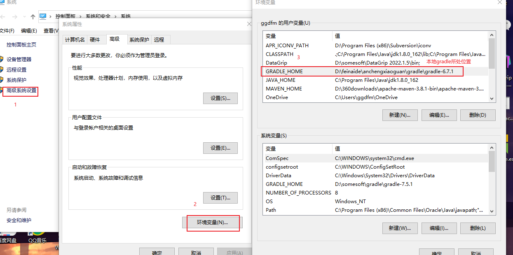
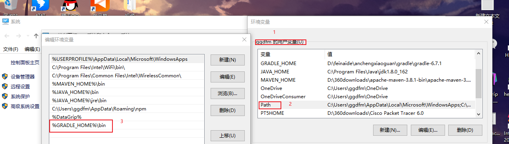

### gradle 是一个基于Apache Ant和Apache Maven概念的项目自动化构建开源工具。  

#### 搭建环境


#### 项目右侧找不到gradle 解决办法
- 只需要选中build.gradle，并且点击鼠标右键，选中import gradle project即可
#### gradle控制台输出乱码解决办法：

#### 导入项目后，类为灰色，可以在项目上右键点击按钮（add as maven project），或者注意检查setting里的gradle里配置的路径是否正确  

#### 引入lombok依赖
- 使用gradle环境时，在gradle5.0以上版本使用annotationProcessor引入lombok依赖，
- 只有compileOnly时使用gradle的build会报错找不到对应生成的代码。
````
//lombok
   // compileOnly 'org.projectlombok:lombok:1.18.24'//只在编译时有效，不会参与打包
    annotationProcessor 'org.projectlombok:lombok:1.18.24'//会将依赖打包
````
- 扩展
````
compileOnly 'org.projectlombok:lombok:1.18.4'
annotationProcessor 'org.projectlombok:lombok:1.18.4'
testCompileOnly 'org.projectlombok:lombok:1.18.4'
testAnnotationProcessor 'org.projectlombok:lombok:1.18.4'
````

### gradle报错问题
- 在gradle环境中出现错误：Expiring Daemon because JVM heap space is exhausted
````
在gradle.properties文件中
#配置编译时的虚拟机大小
org.gradle.jvmargs=-Xmx2048m -XX:MaxPermSize=512m -XX:+HeapDumpOnOutOfMemoryError -Dfile.encoding=UTF-8

---------------------或者都加上以下部分-----------------
#开启线程守护，第一次编译时开线程，之后就不会再开了
org.gradle.daemon=true

#配置编译时的虚拟机大小
org.gradle.jvmargs=-Xmx2048m -XX:MaxPermSize=512m -XX:+HeapDumpOnOutOfMemoryError -Dfile.encoding=UTF-8

#开启并行编译，相当于多条线程再走
org.gradle.parallel=true

#启用新的孵化模式
org.gradle.configureondemand=true

````


