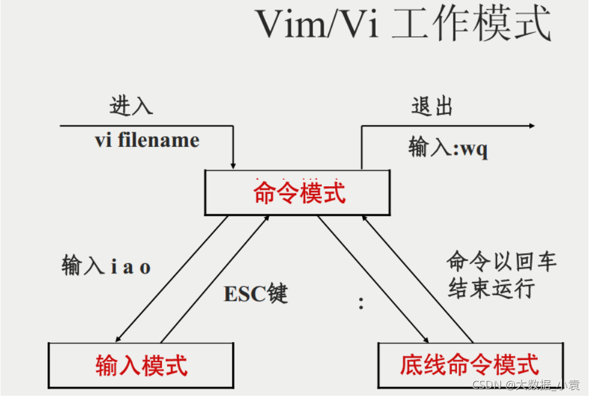

## Linux
{: .no_toc}

### 一些快捷键
- 路径补全:给出的起始路径下，对应字符能够被唯一匹配，则tab键直接补全路径；若是不能被唯一标识，再次tab键，则会给出相应列表
- ctrl+c：终止前台运行的程序
- ctrl+l 清屏 --不是完全清理，相当于翻页
- ctrl+ a 将光标移动到命令行的最前端
- ctrl+e 将光标移动到命令行的最末端
- ctrl+u 删除光标前的所有字符
- ctrl+k 删除光标后的所有字符
- ctrl+d 退出 – 等价于exit
- ctrl+r 搜索历史命令，利用关键词

### Linux是多任务、多用户、支持多线程和多cpu的操作系统。
内容转载：[linux命令大全](https://blog.csdn.net/yuan2019035055/article/details/120584242)
### Linux目录

### 注意事项
````
- 区分大小写 
- 有些命令有选项、参数，有的有其一，有的都没有。命令、选项、参数之间有空格
- 选项的格式为 -字母 -单词 字母，可以有多个选项，多个选项可以合并（例如-a -b，可以为-ab）
````

### Linux的基础命令
- pwd：显示当前用户所处位置
- ls:对于目录，该命令列出该目录下的所有子目录与文件。对于文件，将列出文件名以及其他信息。格式：ls [选项][目录或文件]
````
ls常用选项表：
    -a  查看当前目录下的文件，包括隐藏文件
    -l  长格式显示文件
    -lh  以方便阅读的长格式显示
````
- cd:改变工作目录。将当前工作目录改变到指定的目录下。格式：cd 目录名
````
cd常用命令：
    cd ..       返回上一级目录
    cd ../..    返回上两级目录
    cd ~         切换到家目录
    cd /         切换到根目录
    cd /home/lx/linux1/     绝对路径：从家目录出发，直到想去的目录
    cd ../lx/               相对路径：从当前目录出发，直到想去的目录
````
- man：访问linux的手册页的命令。格式：man 其他命令
- grep：用于查找文件里符合条件的字符串。格式：grep [选项] '查找字符串' 文件名
````
grep常用选项：
    -a  将binary文件以text文件的方式查找数据
    -c  计算找到 ‘查找字符串’ 的次数
    -i  忽略大小写的区别，即把大小写视为相同
    -v  反向选择，即显示出没有 ‘查找字符串’ 内容的那一行
````
- find:用来在指定目录下查找文件。格式：find [路径] [选项] 操作
````
find常用选项：
    -name test      查询指定目录下,命名为test的文件
    -size +100k     查询指定目录下，文件大于100K的文件
    -ctime n        查询指定目录下，在过去n天内被修改过的文件
````
- tail：查看测试项目的日志。说明：一般测试的项目里面，有个logs的目录文件，会存放日志文件，有个xxx.out的文件，可以用tail -f 动态实时查看后端日志。格式：tail [选项] 文件名
````
tail常用选项：
    -f      实时读取
    -1000   查看最近1000行日志
````
### 文件操作的命令
- mkdir：创建空目录。格式：mkdir [选项] [路径] 文件名
````
mkdir常用选项：
    -p  层级创建
    -v  显示创建顺序
````
- rmdir:删除空目录 不能删除非空目录，不能删除文件。格式：rmdir [-p] [路径] 目录名
````
rmdir常用选项：
    -p  当子目录被删除后如果父目录也变成空目录的话，就连带父目录一起删除
````
- touch：新建空文件。格式：touch [路径] 文件名 （可以多个）
- rm:删除文件或目录。格式：rm [选项] 文件名
````
rm常用选项：
    -f  强制删除
    -r  多级删除
    -rf 强制删除给定目录下所有文件和目录
rm与rmdir的区别：
    rm有选项，rmdir没有选项
    rm带上选项-r可以删除非空目录
    rmdir只能删除空目录，不能删除文件
````
- mv：mv命令是move的缩写，可以用来移动文件或者将文件改名（move(rename)files），是Linux系统下常用的命令，经常用来备份文件或者目录。格式：mv [选项] [路径] 旧文件名 [新路径][新文件名]
````
mv常用选项：
    -f  force 强制的意思，如果目标文件已经存在，不会询问而直接覆盖
    -i  若目标文件 (destination) 已经存在时，就会询问是否覆盖
注意：
    如果只移动不改名字，新名字可以不写
    如果移动的同时改名字，新名字一定要写
````
- cp：复制文件或目录。说明：cp指令用于复制文件或目录，如同时指定两个以上的文件或目录，且最后的目的地是一个已经存在的目录，则它会把前面指定的所有文件或目录复制到此目录中。若同时指定多个文件或目录，而最后的目的地并非一个已存在的目录，则会出现错误信息。
  格式：cp [选项] [路径] 旧文件名 [新路径][新文件名]
````
cp常用选项：
    -f 或 --force        强行复制文件或目录， 不论目的文件或目录是否已经存在
    -i 或 --interactive  覆盖文件之前先询问用户
    -r                   递归处理，将指定目录下的文件与子目录一并处理。若源文件或目录的形态，不属于目录或符号链接，则一律视为普通文件处理
    -R 或 --recursive    递归处理，将指定目录下的文件及子目录一并处理
````  
- cat：查看目标文件的内容。格式：cat [选项] 文件名
````
cat常用选项：
    -b  对非空输出行编号
    -n  对输出的所有行编号
    -s  不输出多行空行
````
### vi/vim
- 基本上 vi/vim 共分为三种模式，分别是命令模式（Command mode），输入模式（Insert mode）和底线命令模式（Last
  line mode）。

  
#### 命令模式
- 用户刚刚启动 vi/vim，便进入了命令模式。此状态下敲击键盘动作会被Vim识别为命令，而非输入字符。比如我们此时按下i，并不会输入一个字符，i被当作了一个命令。
- 常用几个命令：
````
- i切换到输入模式，以输入字符
- x删除当前光标所在处的字符
- ：切换到底线命令模式，以在最后一行输入命令
````
- 若想要编辑文本：启动Vim，进入了命令模式，按下i，切换到输入模式。
#### 输入模式：在命令模式下按下 i 就进入了输入模式。
#### 底线命令模式：在命令模式下按下:（英文冒号）就进入了底线命令模式。
- 基本命令（已经省略了冒号）：
````
  q 退出程序
  w 保存文件
````
- 按ESC键可随时退出底线命令模式

