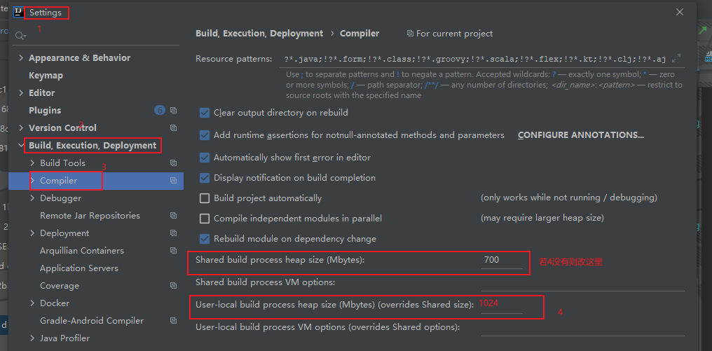

## XiangMu
{: .no_toc}

### 项目使用框架 jdk版本及其他
### 项目部署前需要考虑的问题：
##### 版本兼容问题
````
1.jdk与各种数据库驱动兼容问题
2.jdk与tomcat兼容问题
3.jdk与maven版本兼容问题
4.jdk与各类其他jar包兼容问题
````
#### jar包冲突问题

### 解决jar包导入问题以及项目不能编译问题
````
一个ant的spring项目有多个子工程时，子工程不能被编译，jar包导不进去，
先File->Project Structure->library 查看jar是否导入，
如果没有则找到lib下的jar包，右击选择add library as 添加即可
有jar包之后，File->Project Structure->modules 添加module或者右图点击sources下的子项目，添加mark as行的sources。
````
### 测试时报错：compilation failed :internal java compiler error 需要修改堆内存或者清理内存


### 项目去O 
- 1.切换数据库配置：yml配置、xml配置、properties配置。
    修改驱动信息即可，对于oceanbase配置需要添加initialSize=5参数及值
  
- 2.兼容问题


- 去O项目（将Oracle切换为OB数据库）
 - 1.数据库方言问题
 - 2.在java中直接调用存储过程且配置里有只读配置（read-only）时，需要去掉只读设置，该行为有风险，暂没有相应措施。
 - 3.任务调度（Oracle有调用job的函数，OB没有，需要改造相关功能，建立独立的项目调用批处理。）
 - 4.测试---debug存储过程在游标下与多重for循环下容易报错，是由于OB的性质问题，暂不定性（目前只知道在某些位置加上commit）
    大批量数据的存储过程里 for ...loop ...end loop 可以转换成 loop...end loop


-- 开发、集成、压测
1.开发自行测试
2.集成测试（方便联调）
3.压测（效率，优化代码）


- 压测
· tps是每秒处理事务。可以用来衡量系统的吞吐量。 20tps，表示每秒处理20个事务。
  可以是一个用户一秒处理了20个事务，也可以是有20个用户，每个用户分别在同一秒处理一个事务
  
· 并发数 表示在某一时刻可以处理的同时运行的任务数

- 存储过程的效率问题
·1.insert 时，不必要的字段可以不带  比如有默认值或必为null字段
·2.含有分区表，必须带上分区键，速度会更快
·3.数据量大时，分批次提交（一万一次） 
- 写存储过程顺序
·1.有校验先校验 直接update状态
·2.insert 最好不要一条一条insert 可以insert into table1() select * from table2;
·3.在拼接时不能直接加减变量，需要加上括号
·4.使用拼接sql时,示例如下：
````
declare
v_sql varchar2(2500);
v_claimno varchar2(80);
v_count number;
begin
v_sql := 'insert into table1(...)select *  from table2 where claimno = :claimno';
execute immediate v_sql using v_claimno;
v_count := sql%rowcount;--获得执行的sql：v_sql 插入数据量
end;
--拼接sql时，在v_sql中出现数字时，可以使用''5''包裹，执行时自动转换成'5'。（是两个单引号，不是双引号）
````
·6 有更改数据库操作的子存过都需要加上异常处理进行rollback，以及添加错误日志
````
begin
....
exception
when others then
rollback;
insert into mm_error_log ....;
end;
````
--常见校验
1.有重复数据
````
select nvl(sum(cou),0) into v_count from (select a,b,count(1) from table1 where 1=1 group by a,b having count(1)>1);
if v_count >0 then
--有v_count条重复数据
end if;
````


